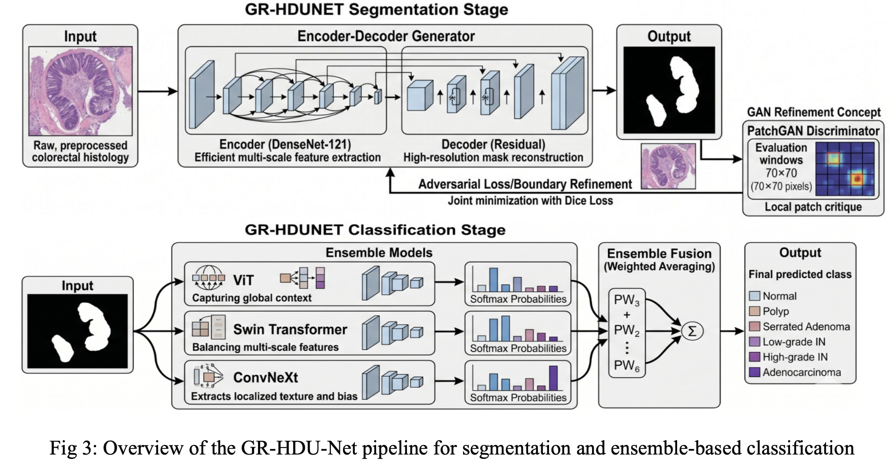
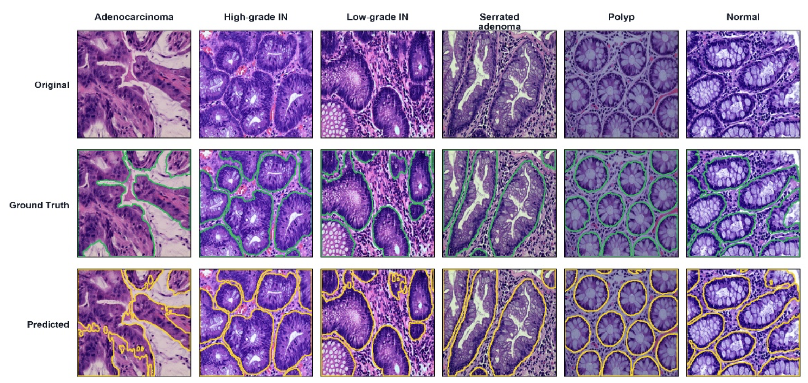
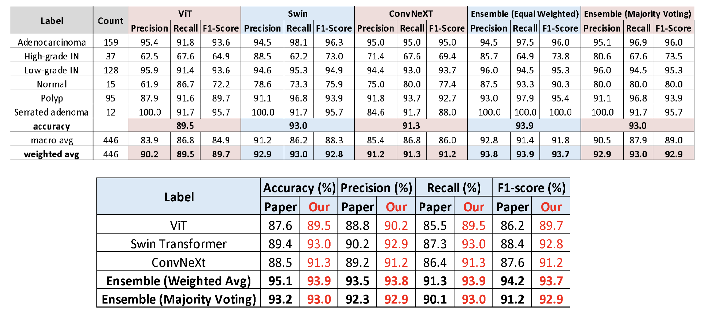
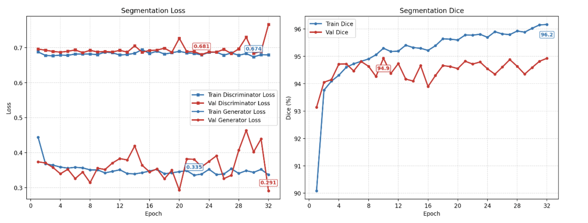
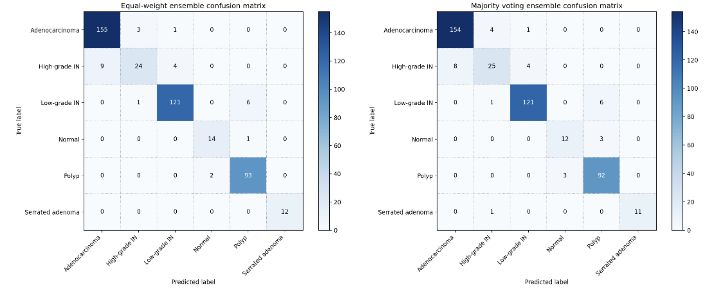
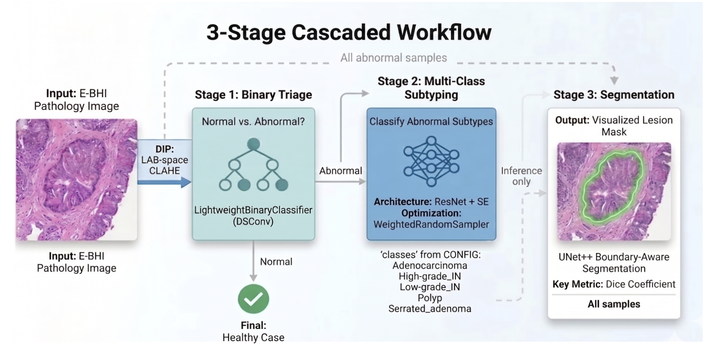
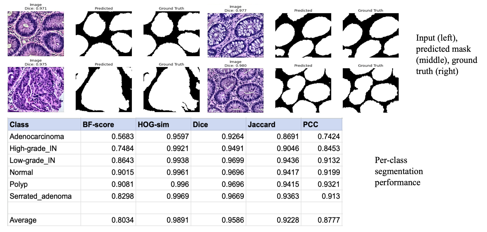
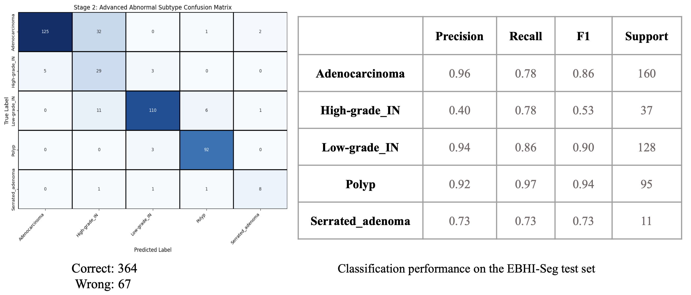

# High-Precision Colorectal Lesion Analysis: GR-HDUNET & HCS-NET

## Project Overview

This repository contains the implementation, training, and evaluation code for classifying and segmenting abnormalities in colorectal pathology slides. The primary focus and main contribution of this project is the **GR-HDUNET** architecture, which is supported by a secondary pipeline, **HCS-NET**.

**Dataset: EBHI-Seg**
The project utilizes the EBHI-Seg dataset, consisting of 2,226 paired images and masks distributed across 6 categories:

* Adenocarcinoma: 795
* Low-grade IN: 637
* Polyp: 474
* High-grade IN: 186
* Normal: 76
* Serrated adenoma: 58

**Data Splits (Approx. 70% Train / 10% Val / 20% Test):**

* Train: 1558 images
* Validation: 223 images
* Test: 445 images

**Hardware Setup:**
All processing, model ensembling, and evaluations were executed on an **NVIDIA A5000 (24 GB VRAM)** to accommodate the heavy memory requirements of multimodal processing and high-resolution medical imaging.

---

## Primary Architecture: GR-HDUNET (Upgraded Multi-Backbone)

GR-HDUNET serves as the main architecture for this repository. It has been upgraded to utilize a powerful ensemble method integrating **ViT, Swin, and ConvNeXt** backbones. This multi-backbone approach improves feature extraction capabilities across multiple scales, significantly enhancing classification precision for complex tissue topologies.

**Key Components & Features:**

* **Ensemble Strategy:** Leverages the combined strengths of Vision Transformers (ViT), Shifted Window Transformers (Swin), and Convolutional Networks (ConvNeXt).
* **Robust Evaluation:** Evaluates ensemble models based on robust clinical metrics including AUC, F1-score, and Accuracy per pathology type.
* **Automated Pipeline:** Features deterministic environment setup, automated metric compilation, and automated generation of ROC curves and detailed metric tables.

**Predictions:**

**Results:**

**Plots:**

**Confusion Matrix:**

---

## Secondary Architecture: HCS-NET

HCS-NET provides a complementary, robust pipeline tailored for highly accurate pathology segmentation. The model effectively maps high-dimensional image data into precise binary segmentation masks.

**Key Components & Features:**

* **Segmentation Focus:** Prioritizes exact overlap between predicted tissue boundaries and expert ground-truth annotations using Dice coefficients.
* **Data Processing:** Implements automated dataset statistics computation, image normalization, and thresholding.
* **Visual Fidelity:** Includes built-in logic for side-by-side comparison of the Original Image, Predicted Mask, and Ground Truth.

**Predictions and Results:**

**Confusion Matrix:**

## 🤝 Contributors - Group 15

* [Akshat Jha](https://github.com/AkshatJha0411)
* [Bhavya Sunkari](https://github.com/Bhavya445)
* [Madhav Aggarwal](https://github.com/madhavCodez1006)
* Harsh Vardhan Sharma
* Shubhankit Singh
* Aashvi Garg
* Anoushka Waghmare
* Sezal Rana
* Mohit Kulhari
